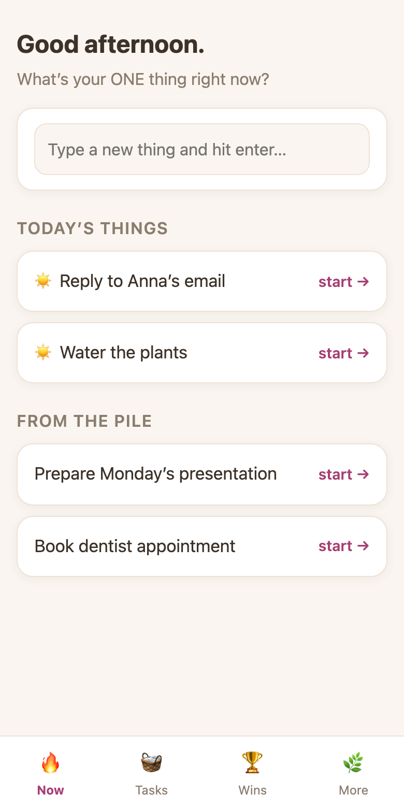
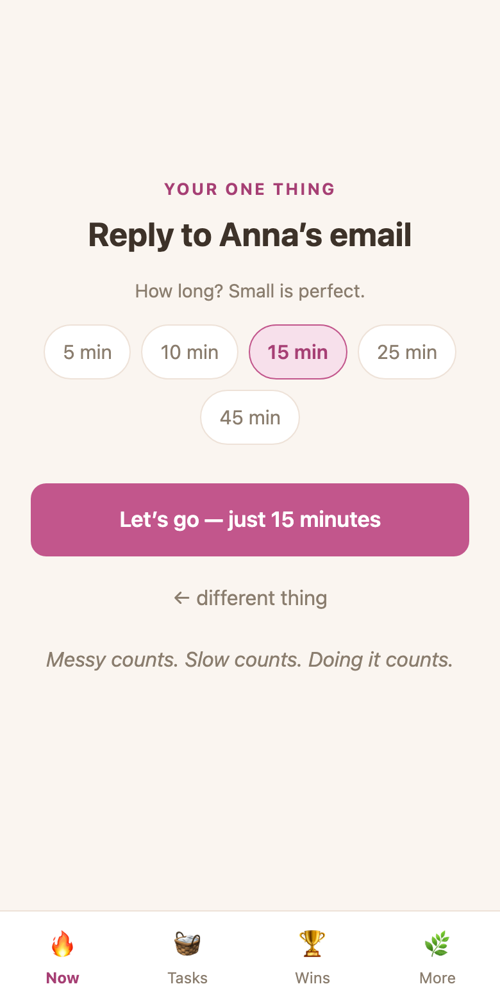
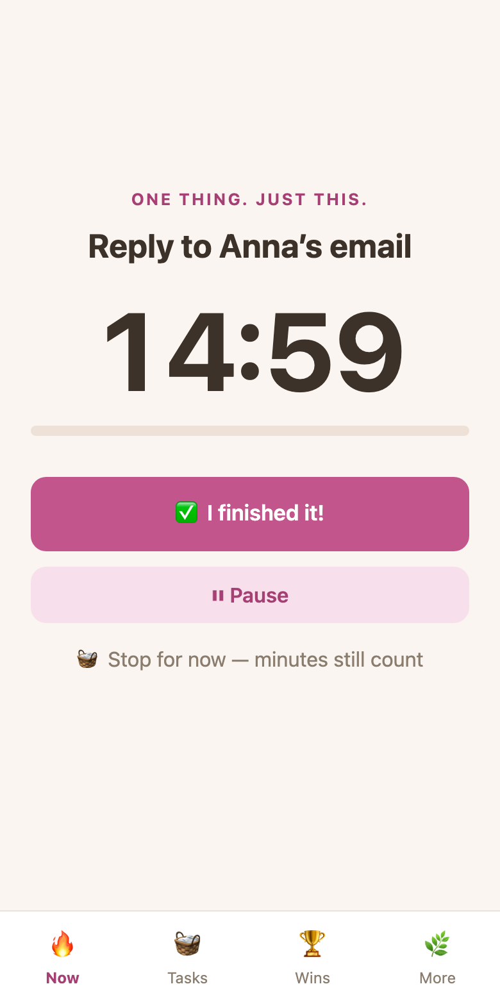
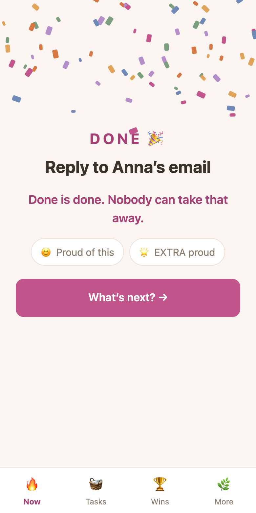
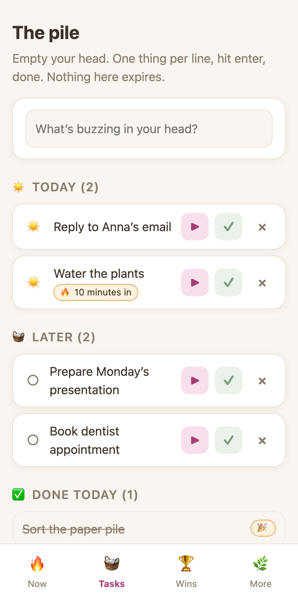
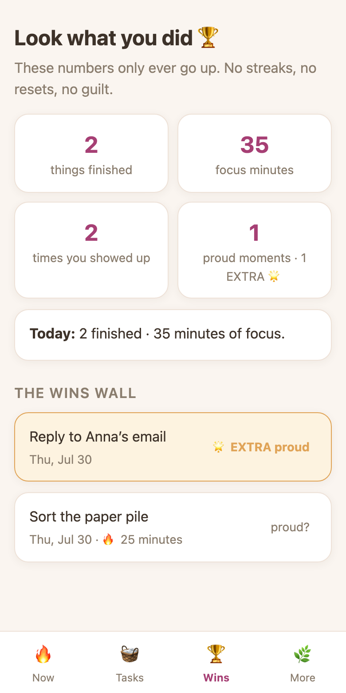

# One Thing 🔥

**One thing. A few minutes. A proud moment. Repeat.**

A tiny, friendly task app for brains that hyperfocus, scatter, and forget (hello, ADHD 👋).
Instead of holding a scary long list, it holds your *attention*: you brain-dump everything,
pick **one** thing, do a small timer, take a break with water, get confetti, and watch your
wins pile up on a wall that never resets.

Try it right now: **https://one-thing-ff.netlify.app**

<p align="center">
  
  
  
  
  
  
</p>

## Why it works (when other to-do apps don't)

1. **Brain dump** (🧺 Tasks) — get everything out of your head, one line at a time. Nothing
   expires, nothing turns red, nothing judges you.
2. **Pick ONE thing** (🔥 Now) — pull one or two tasks into "Today", then pick exactly one.
3. **A small timer** — "just 10 minutes." Starting is the win. Stopping early still counts
   and gets celebrated.
4. **Time's up → bonus mode** — deep in hyperfocus? The timer flips to counting bonus
   minutes instead of nagging you.
5. **Break** — 3 minutes: drink water 💧, stretch 🤸, look out the window 🪟.
6. **Done → confetti 🎉** — mark it "proud 😊" or "EXTRA proud 🌟". It lands on the Wins
   wall forever.

**House rules (non-negotiable):** nothing ever decreases, breaks, streaks, or expires. No red
badges. No guilt. Tasks you planned for today but didn't do just drift quietly back into the
pile overnight.

**Your data is yours:** everything is stored on *your own device* (no account, no cloud, no
tracking). The "More" tab has one-tap backup/restore as a file.

---

## 📱 Use it on your phone (30 seconds, no tech skills needed)

1. Open **https://one-thing-ff.netlify.app** in your phone's browser.
2. Add it to your home screen:
   - **iPhone (Safari):** tap the **Share** button (the square with the arrow ⬆️) → scroll
     down → **"Add to Home Screen"** → **Add**.
   - **Android (Chrome):** tap the **⋮ menu** (top right) → **"Add to Home screen"** or
     **"Install app"** → confirm.
3. That's it. You now have an app icon ✓ that opens full-screen and even works offline.

> 💡 Because data lives on each device, your phone and your laptop each have their own task
> pile. To move data between them: **More → Download backup** on one device, send yourself
> the file, **More → Restore from file** on the other.

---

## 🖥️ Run it on your own laptop (absolute-beginner edition)

You don't need to be a programmer. You need about 10 minutes.

### Step 0 — Install Node.js (one time only)

Node.js is the engine that runs the app locally. Go to **https://nodejs.org**, download the
**LTS** version, and install it like any normal program (keep clicking "Next").

### Step 1 — Get the code

**Easy way (no tools needed):** on this GitHub page, click the green **`<> Code`** button →
**Download ZIP** → unzip it somewhere you'll find it (e.g. your Desktop).

**Nerd way:** `git clone https://github.com/frederikeff/one-thing.git`

### Step 2 — Open a terminal in that folder

The terminal is just a way to type commands to your computer.

- **Mac:** open the **Terminal** app (press `⌘ + Space`, type "Terminal", hit enter).
- **Windows:** open **PowerShell** (press the Windows key, type "PowerShell", hit enter).

Then type `cd ` (with a space) and **drag the app folder onto the terminal window** — it
fills in the path for you. Press enter.

### Step 3 — Install and start (two commands)

```bash
npm install
npm run dev
```

The first command downloads the app's building blocks (only needed once, takes a minute).
The second one starts the app and prints a link like:

```
  ➜  Local:   http://localhost:5173/
```

Open that link in your browser. 🎉 That's the app, running entirely on your machine.
To stop it, press `Ctrl + C` in the terminal. To start it again later, just repeat Step 3's
second command.

---

## 🌍 Put your OWN copy on the internet (free)

Want your own private version at your own web address, installable on your phone?

**One-click way:**

[](https://app.netlify.com/start/deploy?repository=https://github.com/frederikeff/one-thing)

Click the button above. It will:

1. Ask you to sign in (free) to **GitHub** (where the code lives) and **Netlify** (which puts
   websites on the internet).
2. Copy this code into your own GitHub account.
3. Build and publish it at `https://<name-you-pick>.netlify.app`.

That's the address you open on your phone and add to your home screen (see above). From then
on it's **your** copy — your data, your address, and it updates automatically if you ever
change your code on GitHub.

**Manual way:** fork this repo on GitHub → sign up at https://app.netlify.com → "Add new
project" → "Import an existing project" → pick your fork → click Deploy (all build settings
are already configured in `netlify.toml`).

---

## 🔧 For developers

Vite + React, Dexie (IndexedDB), vite-plugin-pwa. No backend, no accounts, no analytics.

```bash
npm install
npm run dev        # local dev server
npm run build      # production build (dist/)
```

Focus timers are stored as timestamps in IndexedDB, so closing the tab or locking your phone
never loses a session. "Today" marks are a local date key that simply stops matching at
midnight — that's how tasks drift back to the pile with no overdue state.

Made by [Frederike](https://github.com/frederikeff) with Claude, as a sibling of
"My Story" — a personal evidence collector for self-trust. MIT licensed: use it, change it,
make it yours.

## Roadmap ideas

- Gentle notification when a break ends
- "Body double" mode: a soft ambient presence while focusing
- Weekly "look what you did" recap composed from the wins wall
- Optional sync between devices
